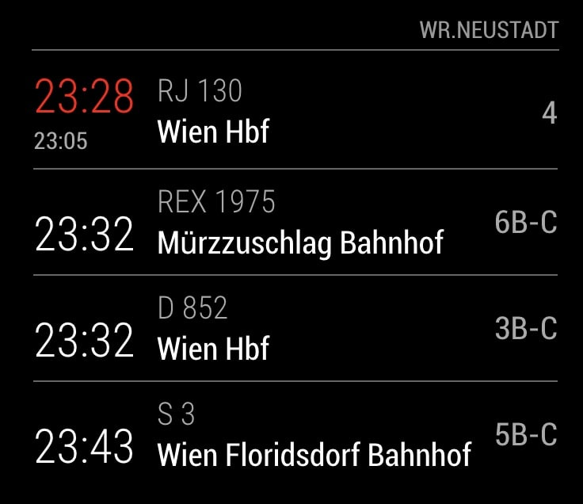

# ÖBB Station Board

Show arrivals and departures of a specific ÖBB station

> Thanks to @mymro for creating the [oebb-api](https://github.com/mymro/oebb-api) which is used the get information for the stations.

## Installation

1. Clone the Repo into your MagicMirror modules folder `git clone git@github.com:mscharl/MMM-oebb-station-board.git`
2. Install some node dependencies `cd MMM-oebb-station-board && npm install --production`
3. [Configure](#configuration) and enjoy

## Configuration

| Property            | Description                                       |
|---------------------|---------------------------------------------------|
| `stationNumber`     | The number of the station. Can be determined with the [helper script](#get-a-station-id).|
| `direction`         | The number of the station in which the shown connection are heading. Can be determined with the [helper script](#get-a-station-id). |
| `boardType`         | Switch between `dep` for departure or `arr` for arrival. Default is `dep`. |
| `maxConnections`    | The maximum number of connections to show. Default is `4`.|
| `connectionTypes`   | Filter the shown transportation types. See [Connection Types](#connection-types) for more. Shows all connections by default. |

### Get a station ID
To load data for you desired station you first need the ID of the station. The module includes a little helper to get this ID.

1. Run `npm install --production` if you did not already.
2. Run `npm run stationFinder`.
3. Follow the instructions.

### Connection Types

The `connectionTypes` property can be undefined to show all connections.
To show only specific types pass an object with one or more of the following flags.

| Property | Description |
|----------|-------------|
| `Railjet` | Shows Railjet trains when `true`. |
| `ECandICE` | Shows EC and ICE trains when `true`. |
| `DandEuronightAndNightjet` | Shows D, Euronight and Nightjet trains when `true`. |
| `Regional` | Shows regional trains when `true`. |
| `SBahn` | Shows Schnellbahn trains when `true`. |
| `Bus` | Shows Buses when `true`. |
| `Subway` | Shows Subways when `true`. |
| `Tram` | Shows Trams when `true`. |
| `Westbahn` | Shows Westbahn trains when `true`. |
| `AST` | Shows AST when `true`. |

## Planned Features
 - [ ] Combine multiple stations in one board
 - [ ] Combine multiple directions per station
